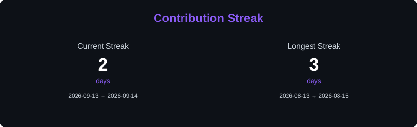

# 👋 Hey, I'm Raghav Pandey

### 🤖 AI/ML Developer • 💻 Full Stack Developer • 🚀 Problem Solver

 

  

---

## 🧑‍💻 About Me

I'm a developer passionate about **Artificial Intelligence, Machine Learning, Computer Vision and Full Stack Development**.

I enjoy taking an idea 💡 and turning it into a working project 🚀.

* 🤖 Artificial Intelligence & Machine Learning
* 🧠 Deep Learning
* 👁️ Computer Vision
* 🌐 Full Stack Development
* 💻 Data Structures & Algorithms
* 📊 Data Analysis & Visualization
* 🚀 Building real-world applications
* 📚 Always learning something new

---

## ⚡ What I Build

|    🤖 AI & ML    | 👁️ Computer Vision | 🌐 Full Stack |
| :--------------: | :-----------------: | :-----------: |
| Machine Learning |   Pose Estimation   |    Node.js    |
|   Deep Learning  |   Image Processing  |   Express.js  |
|        NLP       | Real-time Detection |    MongoDB    |
|   Generative AI  |   AI Applications   |   Streamlit   |
|        RAG       |        OpenCV       |   REST APIs   |

---

## 🛠️ Tech Stack

### 💻 Programming Languages

  

### 🤖 AI / Machine Learning

  

  

### 📊 Data Science

  

### 🌐 Web Development

  

  

### ⚙️ Tools

---

## 🚀 Featured Projects

| 🚀 Project             | 💡 Description                                     | 🛠️ Technologies                     |
| :--------------------- | :------------------------------------------------- | :----------------------------------- |
| 🏋️ **AI GYM Trainer** | Real-time AI workout and exercise detection system | Python • Streamlit • Computer Vision |
| 📸 **SnapClass**       | AI-powered attendance management system            | Python • Streamlit • Supabase        |
| 👥 **Clan Manager**    | Gaming community management application            | Node.js • Express • MongoDB          |
| 🧠 **ML Projects**     | Machine Learning & Deep Learning experiments       | Python • PyTorch • TensorFlow        |

---

## 🧠 Currently Exploring

`Generative AI` • `RAG` • `LangChain` • `Computer Vision` • `Deep Learning` • `NLP` • `Hugging Face`

---
# 📊 GitHub Statistics

### 📈 GitHub Stats

  

### 🔥 Contribution Streak

---

## 🏆 GitHub Achievements

---

## 🐍 Contribution Snake

---

## 📌 GitHub Profile

---

## 🎯 2026 Goals

| 🎯 Goal                                     |     Status     |
| :------------------------------------------ | :------------: |
| 🤖 Build production-level AI applications   | 🔥 In Progress |
| 🧠 Improve DSA & problem solving            | 🔥 In Progress |
| 👁️ Build advanced Computer Vision projects | 🔥 In Progress |
| 🌐 Build scalable Full Stack applications   | 🔥 In Progress |
| 📚 Deepen AI/ML knowledge                   | 🔥 In Progress |
| 🌍 Contribute to Open Source                | 🎯 Coming Soon |
| 🚀 Build projects that solve real problems  |    ♾️ Always   |

---

## 💡 Developer Philosophy

### Think → Code → Break → Debug → Learn → Build Again 🔥

 

> **"The best way to learn is to build."**

---

## 🌐 Connect With Me

 

### ⭐ Thanks for visiting my profile!

